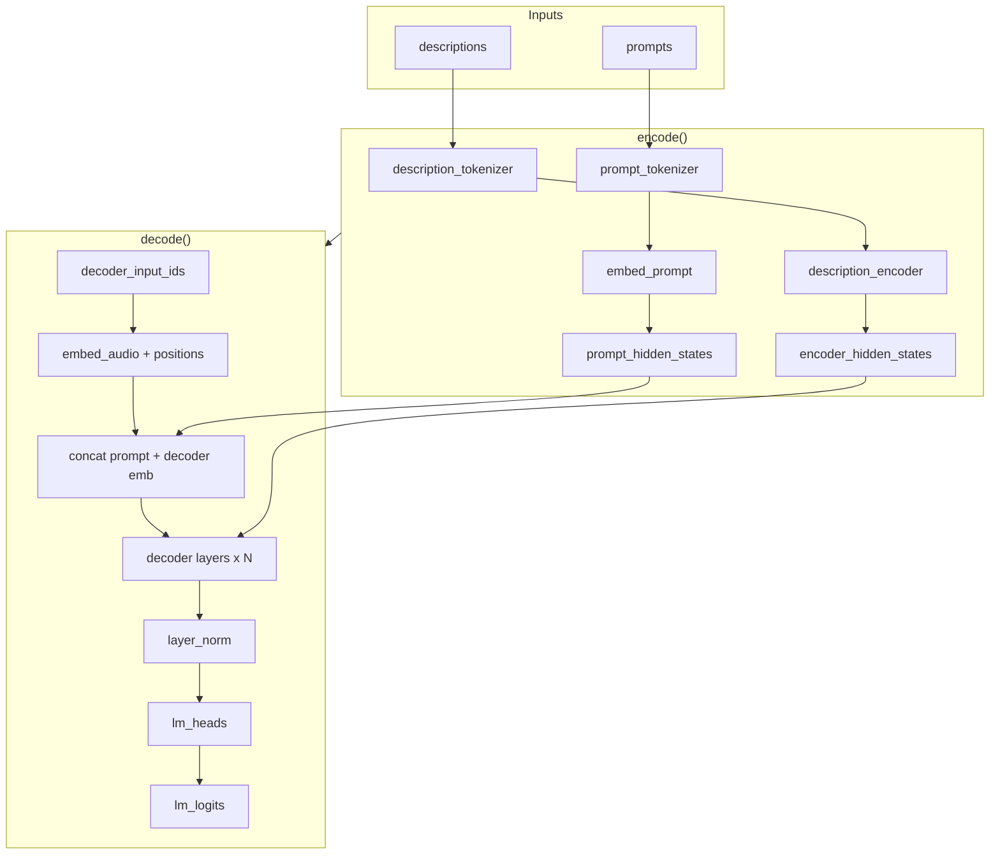

# Parler-TTS Paged: Prefill, Decode, and KV Cache Explained

This document explains the **entry point** (`test_prefill()` in `main.py`) and the **Parler-TTS paged model** in this folder. We **do not assume** you already know how transformers or attention work: the first sections build up the needed concepts from scratch.

---

## Table of Contents

1. [Foundations: From text to vectors to attention](#0-foundations-from-text-to-vectors-to-attention)
2. [High-level: What is Parler-TTS?](#1-high-level-what-is-parler-tts)
3. [Core concepts: Attention and KV cache](#2-core-concepts-attention-and-kv-cache)
4. [Architecture overview](#3-architecture-overview)
5. [Entry point: `test_prefill()` line by line](#4-entry-point-test_prefill-line-by-line)
6. [How `encode()` works](#5-how-encode-works)
7. [How `decode()` works (prefill vs step)](#6-how-decode-works-prefill-vs-step)
8. [Paged attention and flex_attention](#7-paged-attention-and-flex_attention)
9. [References](#8-references)

---

## 0. Foundations: From text to vectors to attention

This section introduces the ideas you need **before** we talk about Parler-TTS: how text becomes numbers, what “attention” is, and how encoder–decoder models generate output step by step.

### 0.1 Neural networks in one sentence

A **neural network** takes some **numbers in** (e.g. a vector or a matrix), applies a series of **layers** (linear maps, nonlinearities, etc.), and produces **numbers out**. We “train” it so that for the inputs we care about, the outputs match what we want (e.g. correct class, next token). Everything inside the model is just **vectors and matrices** of floating-point numbers.

### 0.2 Tokens and tokenization

Computers don’t see words—they see numbers. So we first turn text into a list of **tokens** (pieces of text: words, subwords, or characters) and then map each token to an **ID** (an integer).

- **Tokenization**: the tokenizer splits text into tokens and maps them to integer IDs:

```python
# Example (conceptually)
text = "hello world"
tokens = tokenizer(text)            # e.g. ["hello", " world"]
input_ids = tokenizer.encode(text)  # e.g. [1234, 5678]  → shape (1, 2) for batch=1
```

So e.g. `"hello world"` → tokens → IDs `[1234, 5678]`.
- The model never sees the string; it only sees the **sequence of IDs** (a tensor of shape “batch × sequence length”).

In this codebase we have two tokenizers: one for the **description** (voice description text) and one for the **prompt** (the text to speak). Each produces `input_ids`: the list of token IDs for that text.

### 0.3 Embeddings: from IDs to vectors

An **embedding layer** is a lookup table: for each token ID (e.g. 1234), it returns a **vector of numbers** of fixed size (e.g. 1024 numbers). So we go from **discrete IDs** to **continuous vectors** that the rest of the network can process.

- **Shape**: one sequence of length L with IDs → after embedding we get a tensor of shape `(batch, L, hidden_size)`:

```python
# input_ids: (batch, L),  embed_layer: nn.Embedding(vocab_size, hidden_size)
embeddings = embed_layer(input_ids)  # → (batch, L, hidden_size)
```

So we have one vector per token position; that vector is the “representation” of that token that the model will use.
- These vectors are **learned** during training. Similar tokens (or tokens that play similar roles) often get similar vectors.

So after tokenization + embedding, we have: **sequence of vectors** = matrix of shape `(batch, sequence_length, hidden_size)`.

### 0.4 What is “attention”? (intuition)

Imagine you have a row of people (the “sequence”), each holding a slip of paper (their **value**). For each person in turn, we ask: “**Who should you listen to?**” That’s **attention**: at each position we decide **how much to listen to** every other position, then we take a **weighted average** of their slips of paper.

- **Query**: “What am I looking for?” (comes from the current position.)
- **Key**: “What do I offer?” (comes from each position we might attend to.)
- **Value**: “What I actually contribute.” (also from each position.)

We compare the **query** of the current position with the **key** of every position → that gives a **score** (how relevant each other position is). We turn scores into **weights** (positive, sum to 1) with **softmax**. Then we take the **weighted sum of the values**. So: **output at this position = “mix of information from other positions, where the mix is decided by query–key similarity.”**

That’s one **attention head**. In practice we use **multiple heads** (several independent Q/K/V projections) so the model can look at different kinds of relationships at once.

### 0.5 Why three different things: Q, K, V?

We could in principle use the same vector as query, key, and value. But we get a more expressive model if we **learn separate linear maps** (projections) for:

- **Q (query)**: “What am I looking for?” — depends on the **current** position.
- **K (key)**: “What do I offer for being attended to?” — depends on each **source** position.
- **V (value)**: “What information do I give?” — also from each source position.

So the **same** hidden state is transformed into Q, K, and V by three different learned matrices. That lets the model learn different roles: e.g. “match on meaning” (Q–K) but “output something else” (V).

### 0.6 Softmax and masks

- **Softmax**: takes a vector of scores (any real numbers) and turns them into **probabilities** (positive, sum to 1). Large score → large weight; very negative score → weight almost 0.
- **Mask**: we often don’t want to attend to every position. We add a **mask** (e.g. −∞ for positions we must ignore). After softmax, those positions get weight 0. So:
  - **Causal mask**: “don’t look at the future.” At position 3 we only attend to positions 0, 1, 2 (and maybe 3). Used in the decoder so it can’t cheat by seeing later tokens.
  - **Padding mask**: “ignore padding tokens.” So we don’t attend to fake positions added to make all sequences the same length.

### 0.7 Encoder vs decoder (high level)

- **Encoder**: sees the **entire input** at once (e.g. the full description sentence). No causal mask—every position can look at every other. It runs **once** and produces one representation of the input (e.g. one vector per token, or one summary vector). That representation is the **encoder output** (in our case: “encoder hidden states”).
- **Decoder**: generates the **output one step at a time** (autoregressive). At each step it can only look at **past** positions (causal mask). It uses:
  - Its **own** previous tokens (via **self-attention** over decoder positions),
  - The **encoder output** (via **cross-attention**: decoder queries, encoder keys/values).

So: **Encoder = “understand the input.” Decoder = “generate the output step by step, using the input and what I’ve already generated.”**

### 0.8 Autoregressive generation

**Autoregressive** means: we generate **one token at a time**, and each new token is conditioned on **all previous tokens**.

1. We feed the decoder some **initial** tokens (e.g. start symbol + maybe prompt).
2. The decoder outputs **logits** (scores for “what could the next token be?”). We sample or take argmax to get the **next token**.
3. We **append** that token to the sequence and run the decoder again to get the next logits.
4. Repeat until we produce an end token or hit a length limit.

```python
# Autoregressive generation loop (conceptually)
token_ids = [BOS] + prompt_token_ids   # initial input
kv_cache, encoder_kv_cache = None, None
while True:
    logits, kv_cache, encoder_kv_cache = model.decode(
        decoder_input_ids=...,
        model_kv_cache=kv_cache,
        model_encoder_kv_cache=encoder_kv_cache,
    )
    next_token = logits[:, :, -1, :].argmax(dim=-1)  # or sample
    token_ids.append(next_token)
    if next_token == EOS or len(token_ids) >= max_len:
        break
```

So at step t we only **add one new token**; the rest of the sequence is the same as before. That’s why we can **cache** keys and values for past positions and only compute K, V for the new token—the **KV cache** (see below).

### 0.9 Layers, LayerNorm, residual, FFN

- **Layer**: a **block** of operations (e.g. self-attention + residual, then cross-attention + residual, then FFN + residual). We **stack** many such blocks; each block’s output is the next block’s input. Deeper = more capacity to model complex patterns.
- **LayerNorm**: normalizes the vector at each position (zero mean, unit variance). Helps training stability. We often apply it **before** attention or FFN (“pre-norm”).
- **Residual connection**: we add the **input** of the block to its **output**:

```python
output = input + sublayer(input)   # e.g. output = x + self_attn(layernorm(x))
```

So the network can learn small corrections; gradients flow more easily.

- **FFN (feed-forward network)**: after attention we apply a small 2-layer MLP at each position independently:

```python
# In code (layers.py): fc1 → activation → fc2
hidden_states = self.fc1(hidden_states)
hidden_states = self.activation_fn(hidden_states)
hidden_states = self.fc2(hidden_states)
# Same weights for every position; different per layer.
```

- **Logits**: the **raw scores** the model outputs for “what is the next token?” Before softmax they’re called logits; after softmax they’re probabilities over the vocabulary.

---

## 1. High-level: What is Parler-TTS?

**Parler-TTS** is a **text-to-speech (TTS)** model. Given:

- **Prompt**: the text to speak (e.g. *"अरे, तुम आज कैसे हो?"*),
- **Description**: how the voice should sound (e.g. *"Divya's voice is monotone yet slightly fast..."*),

it produces **audio** (often as discrete tokens from a vocoder, which are then converted to waveform).

The model is **encoder–decoder**:

- **Encoder**: processes the **description** (and optionally prompt context) into a single representation.
- **Decoder**: autoregressively generates the **audio tokens** (or an intermediate representation), attending to the encoder output and to the prompt.

So the flow is: **Description + Prompt → Encoder → Decoder → Audio tokens**.

---

## 2. Core concepts: Attention and KV cache

### 2.1 Attention: the math (building on §0.4)

For **one head**, with sequence length S and head dimension d:

```python
# 1. Scores: (S, S) matrix — how much each position attends to each other
scores = (Q @ K.transpose(-2, -1)) / math.sqrt(d)  # Q,K shape (B, H, S, d)
scores = scores + mask  # mask: -inf for forbidden (e.g. causal), 0 elsewhere

# 2. Weights: softmax so each row sums to 1
weights = torch.softmax(scores, dim=-1)  # (B, H, S, S)

# 3. Output: weighted sum of values
output = weights @ V  # (B, H, S, S) @ (B, H, S, d) → (B, H, S, d)
```

1. **Scores**: `score[q, k] = (Q[q] · K[k]) / √d` → score matrix shape (S, S). The √d keeps dot products from growing too large before softmax.
2. **Weights**: `weights[q, :] = softmax(scores[q, :])` → for each query position, a distribution over key positions (positive, sum to 1).
3. **Output**: `output[q] = Σ_k weights[q, k] * V[k]` → output at q is a blend of the value vectors.

**In one line**: each position's output = "weighted average of all value vectors, with weights from query–key similarity (and mask)."

### 2.2 Minimal example of attention (3 positions)

Suppose we have 3 positions, and for one head the scores (before softmax) are:


|       | pos 0 | pos 1 | pos 2 |
| ----- | ----- | ----- | ----- |
| pos 0 | 2.0   | −∞    | −∞    |
| pos 1 | 1.0   | 1.5   | −∞    |
| pos 2 | 0.5   | 1.0   | 2.0   |


(The −∞ is the **causal mask**: position 0 can't see 1 or 2; position 1 can't see 2.)

After **softmax** on each row, we get weights (example):

```python
# Row 0: [1, 0, 0];  row 1: e.g. [0.27, 0.73, 0];  row 2: e.g. [0.12, 0.27, 0.61]
weights[2, :] = [0.12, 0.27, 0.61]  # at position 2 we attend 12% to pos 0, 27% to pos 1, 61% to pos 2
output[2] = 0.12*V[0] + 0.27*V[1] + 0.61*V[2]  # blend of the three value vectors
```

So at position 2 the output is a weighted sum of V[0], V[1], V[2]. That's exactly what attention does: **reweight and sum the values using query–key scores**.

### 2.3 Self-attention vs cross-attention

- **Self-attention**: Q, K, and V all come from the **same** sequence (e.g. the decoder's current hidden states). So each decoder position "looks at" other decoder positions; the model mixes information **within** that sequence. We use a **causal mask** (see §0.6) so position t only sees positions 0…t.
- **Cross-attention**: Q comes from one sequence (decoder), K and V from **another** (encoder output). So each decoder position "looks at" the encoder and pulls in that information. We can look at **all** encoder positions (no causal mask on the encoder side).

In this model:

- **Decoder self-attention**: decoder positions attend to **previous** decoder positions (causal). This lets the model use the prompt and already-generated audio tokens.
- **Decoder cross-attention**: decoder positions attend to **encoder hidden states** (the description). This lets the model know "what voice" to produce.

### 2.4 KV cache (why it exists)

During **autoregressive decoding** (see §0.8), we generate one token at a time. For each new token we run the decoder again on the **full sequence so far**. Without a cache we would recompute keys and values for all previous positions every time, which is wasteful.

**KV cache**: we **store** the keys and values of previous positions. When we add one new token we only compute keys/values for that token, **concatenate** with the cache, and run attention once:

```python
# Prefill (first call): no cache, process full sequence, fill cache
if model_kv_cache is None:
    K, V = compute_kv(full_sequence)   # all positions
    cache = (K, V)
    logits = attention(Q, K, V)

# Decode step (later calls): one new token, append to cache
else:
    K_new, V_new = compute_kv(new_token_only)
    K = torch.cat([cache[0], K_new], dim=2)
    V = torch.cat([cache[1], V_new], dim=2)
    cache = (K, V)
    logits = attention(Q_new, K, V)
```

- **Prefill**: process the whole "prefix" (e.g. prompt + initial decoder tokens) once; fill the KV cache.
- **Decode step**: one new token; read from cache + new K,V; produce next-token logits and update the cache.

In this codebase:

- **Decoder self-attention** uses a KV cache (either “dense” `(K, V)` or **paged** for flex_attention).
- **Cross-attention** to the encoder also uses a cache: the encoder output is fixed, so we cache encoder K,V per layer to avoid recomputing them every step.

---

## 3. Architecture overview

```text
┌─────────────────────────────────────────────────────────────────────────────┐
│                         ParlerTTS (encoder–decoder)                          │
├─────────────────────────────────────────────────────────────────────────────┤
│                                                                             │
│  INPUTS                                                                     │
│  • prompts:      ["अरे, तुम आज कैसे हो?"]                                   │
│  • descriptions: ["Divya's voice is monotone yet slightly fast..."]          │
│                                                                             │
│  ┌─────────────────────────────────────────────────────────────────────┐   │
│  │ encode(prompts, descriptions)                                        │   │
│  │                                                                      │   │
│  │  description_tokenizer → description_encoder (T5)                     │   │
│  │       → encoder_hidden_states  [B, enc_len, D]                       │   │
│  │                                                                      │   │
│  │  prompt_tokenizer → embed_prompt                                     │   │
│  │       → prompt_hidden_states   [B, prompt_len, D]                    │   │
│  │                                                                      │   │
│  │  return: encoder_hidden_states, prompt_hidden_states                 │   │
│  └─────────────────────────────────────────────────────────────────────┘   │
│                                          │                                  │
│                                          ▼                                  │
│  ┌─────────────────────────────────────────────────────────────────────┐   │
│  │ decode(decoder_input_ids, decoder_position_ids,                      │   │
│  │        encoder_hidden_states, prompt_hidden_states,                   │   │
│  │        model_kv_cache=None, model_encoder_kv_cache=None, ...)         │   │
│  │                                                                      │   │
│  │  • Embed decoder inputs (audio tokens) + positions                   │   │
│  │  • If first call (prefill): concat prompt_hidden_states with          │   │
│  │    embedded decoder inputs; no past KV cache                         │   │
│  │  • For each decoder layer:                                           │   │
│  │      - Self-attention (causal) + optional paged KV cache              │   │
│  │      - Cross-attention to encoder_hidden_states + encoder KV cache   │   │
│  │      - FFN (fc1 → activation → fc2)                                  │   │
│  │  • layer_norm → lm_heads → lm_logits                                 │   │
│  │  return: lm_logits, model_kv_cache, model_encoder_kv_cache           │   │
│  └─────────────────────────────────────────────────────────────────────┘   │
│                                                                             │
└─────────────────────────────────────────────────────────────────────────────┘
```

**One decoder layer** (see `layers.py` – `DecoderLayer`):

```text
hidden_states
    │
    ├─► LayerNorm → Self-Attention (causal, paged or dense KV cache) ──► + residual
    │
    ├─► LayerNorm → Cross-Attention (encoder K,V, with cache) ──────────► + residual
    │
    └─► LayerNorm → FFN (fc1 → activation → fc2) ──────────────────────► + residual
```

**Mermaid diagram** (for viewers that support it):




### 3.1 Terms you'll see in the code

- **hidden_states**: The main representation inside the model—a tensor of shape `(batch, sequence_length, hidden_size)`. Each position holds one vector; after attention or FFN we get updated hidden states.

```python
hidden_states.shape   # e.g. (1, 128, 1024) for batch=1, seq_len=128, hidden_size=1024
```

- **encoder_hidden_states**: The encoder's output (see §0.7)—one vector per encoder token. The decoder uses these as the **key/value** source in cross-attention.

```python
encoder_hidden_states.shape  # (batch, enc_seq_len, hidden_size)
```

- **logits**: Raw scores for "what could the next token be?" (one score per vocabulary token). We apply softmax to get probabilities, or take argmax to pick the next token (see §0.9).

```python
lm_logits.shape  # (batch, num_codebooks, seq_len, vocab_size); logits for next token
next_token_id = lm_logits[:, :, -1, :].argmax(dim=-1)  # take last position, argmax
```

- **mask** (causal, padding): Causal mask ensures the decoder cannot look at future positions (§0.6). Padding mask hides padding tokens so we don't attend to them.

```python
# Causal: mask[i,j] = 0 if j <= i else -inf (or True/False for SDPA)
# Padding: mask positions where input_ids == pad_token_id
```

- **past_key_values / KV cache**: Stored keys and values from previous positions so we don't recompute them at each decode step (§2.4). Per layer: `(K, V)` or paged `(K, V, paged_attention, k_cache, v_cache)`.
- **LayerNorm, residual, FFN**: Standard building blocks of a transformer layer (§0.9).

---

## 4. Entry point: `test_prefill()` line by line

`test_prefill()` checks that the paged model matches a **reference** (saved tensors from a non-paged or different implementation). It does:

1. **Load reference data** (encoder output, prompt embeddings, decoder inputs, masks, expected logits and KV).
2. **Check encode path**: description → encoder; prompt → embeddings.
3. **Run prefill**: `encode` + `decode` with no KV cache; compare logits and encoder KV cache.
4. **Run one decode step**: pass in the KV caches; compare updated caches.

Below we go through the code block you highlighted, with theory where useful.

---

### 4.1 Setup: prompts, descriptions, and reference file

```python
def test_prefill():
    prompts = ["अरे, तुम आज कैसे हो?"]
    descriptions = [
        "Divya's voice is monotone yet slightly fast in delivery, with a very close recording that almost has no background noise."
    ]
    ref = torch.load(
        "/home/sasank/code/inference-opt/checkpoints/values_to_save.pt",
        weights_only=False,
        map_location=torch.device("cpu"),
    )
```

- **prompts**: one text string to be spoken (Hindi).
- **descriptions**: one voice description (style, speed, recording quality).
- **ref**: reference checkpoint containing expected encoder outputs, prompt hidden states, decoder inputs, attention masks, prefill logits, and past key/values. All comparisons are done against this and a second file for the decode step.

---

### 4.2 Check: description → encoder

```python
    # description -> encoder
    expected_encoder_outputs = ref["encoder_outputs"].last_hidden_state
    desc_tokens = model.description_tokenizer(descriptions, return_tensors="pt")
    encoder_outputs = model.description_encoder(
        desc_tokens["input_ids"]
    ).last_hidden_state
    assert torch.allclose(expected_encoder_outputs, encoder_outputs, atol=1e-4)
```

- **Concept**: As in **§0.2**, we **tokenize** the description (text → token IDs). As in **§0.7**, the **T5 encoder** sees the full input at once and outputs one vector per token. The encoder’s `last_hidden_state` is the contextual representation of the description (one vector per token). The decoder will use these vectors in **cross-attention** (§2.3).
- **Code**: Tokenize `descriptions`, run `description_encoder`, take `last_hidden_state`, and assert it matches the reference encoder output.

---

### 4.3 Check: prompt → embeddings

```python
    # prompts -> embeddings
    expected_prompt_hidden_states = ref["prompt_hidden_states"]
    prompt_tokens = model.prompt_tokenizer(prompts, return_tensors="pt")
    prompt_hidden_states = model.embed_prompt(prompt_tokens["input_ids"])
    assert torch.allclose(
        expected_prompt_hidden_states, prompt_hidden_states, atol=1e-4
    )
```

- **Concept**: As in **§0.2** we **tokenize** the prompt (with a different tokenizer). As in **§0.3**, an **embedding** layer (`embed_prompt`) turns each token ID into a vector. These vectors are **prepended** to the decoder’s sequence at prefill so the model conditions on the text to be spoken.
- **Code**: Tokenize `prompts`, embed with `embed_prompt`, and assert against reference prompt hidden states.

---

### 4.4 Load decoder inputs and masks from reference

```python
    decoder_input_ids = ref["decoder_input_ids"]
    decoder_position_ids = ref["decoder_position_ids"]
    self_attn_mask = ref["decoder_attention_mask"]
    cross_attn_mask = ref["attention_mask"]

    expected_logits = ref["prefill_logits"]
    expected_past_key_values = ref["past_key_values"]
```

- **decoder_input_ids**: Token IDs for the decoder side (e.g. BOS or first audio tokens)—same idea as **§0.2**. Shape typically `(batch, seq_len)`; inside `decode` they are reshaped for multiple codebooks.
- **decoder_position_ids**: Position index for each decoder position (needed for **positional embeddings** and for paged attention).
- **self_attn_mask**: The **causal mask** (§0.6) for decoder self-attention: each position only sees itself and previous positions (no future).
- **cross_attn_mask**: Mask for cross-attention (e.g. encoder padding), so the decoder does not attend to padding in the encoder.
- **expected_logits**: reference next-token logits after prefill.
- **expected_past_key_values**: reference KV cache after prefill (per layer: self-attn K,V and encoder-attn K,V). Used to verify encoder K,V and, in a second part, self-attn K,V.

---

### 4.5 Run full encode + prefill decode

```python
    encoder_hidden_states, prompt_hidden_states = model.encode(prompts, descriptions)
    logits, model_kv_cache, model_encoder_kv_cache = model.decode(
        decoder_input_ids=decoder_input_ids,
        decoder_position_ids=decoder_position_ids,
        encoder_hidden_states=encoder_hidden_states,
        prompt_hidden_states=prompt_hidden_states,
        self_attn_mask=self_attn_mask,
        cross_attn_mask=cross_attn_mask,
    )
```

- **encode**: Produces `encoder_hidden_states` (description encoding) and `prompt_hidden_states` (prompt embeddings), as in the diagram.
- **decode** (prefill mode): No `model_kv_cache` or `model_encoder_kv_cache`, so this is the **first** forward pass. Inside `decode`:
  - Decoder inputs are embedded and **concatenated with** `prompt_hidden_states` on the sequence dimension.
  - Position embeddings are applied.
  - For each layer: self-attention runs over the full sequence (with paged or dense cache), then cross-attention to `encoder_hidden_states` (encoder KV cache is filled). Then FFN.
  - Final layer norm and LM head give **logits**.
- **Returns**: `logits` (to compare to reference), `model_kv_cache` (decoder self-attn KV per layer), `model_encoder_kv_cache` (encoder K,V per layer).

---

### 4.6 Assert prefill logits and encoder KV cache

```python
    assert torch.allclose(expected_logits, logits[0], atol=1e-3), (
        f"Logits mismatch: max diff {torch.abs(expected_logits - logits[0]).max().item()}"
    )

    for layer_id in range(model.config["decoder"]["num_hidden_layers"]):
        # Paged path: self-attn cache is materialized from physical cache; may differ slightly
        # from reference (flex_attention vs SDPA). Only check encoder cache for parity.
        assert torch.allclose(
            expected_past_key_values[layer_id][2],
            model_encoder_kv_cache[layer_id][0],
            atol=1e-4,
        )
        assert torch.allclose(
            expected_past_key_values[layer_id][3],
            model_encoder_kv_cache[layer_id][1],
            atol=1e-4,
        )
```

- **Logits**: We expect prefill logits to match the reference (within `atol=1e-3`). `logits[0]` is used because the model may return shape that includes a codebook dimension.
- **Encoder KV cache**: In the reference, `past_key_values[layer_id]` is typically `(self_k, self_v, enc_k, enc_v)` or similar. Indices `[2]` and `[3]` are the **encoder** K and V. The test checks that our `model_encoder_kv_cache[layer_id][0]` and `[1]` match that encoder K and V. Self-attn cache is not asserted here because the paged path (flex_attention) can differ slightly from the reference (e.g. SDPA).

```python
# Reference tuple per layer: (self_k, self_v, enc_k, enc_v)
# We compare encoder part only:
expected_past_key_values[layer_id][2]  # ref encoder K
expected_past_key_values[layer_id][3]  # ref encoder V
model_encoder_kv_cache[layer_id][0]    # our encoder K
model_encoder_kv_cache[layer_id][1]    # our encoder V
```

---

### 4.7 Load step reference and run one decode step

```python
    # model step (decode one token with cached state)
    step_ref = torch.load(
        "/home/sasank/code/inference-opt/checkpoints/model_step.pt",
        weights_only=False,
        map_location=torch.device("cpu"),
    )
    step_decoder_input_ids = step_ref["decoder_input_ids"]
    step_decoder_position_ids = step_ref["decoder_position_ids"]
    step_logits, step_model_kv_cache, step_model_encoder_kv_cache = model.decode(
        encoder_hidden_states=encoder_hidden_states,
        decoder_input_ids=step_decoder_input_ids,
        decoder_position_ids=step_decoder_position_ids,
        model_kv_cache=model_kv_cache,
        model_encoder_kv_cache=model_encoder_kv_cache,
    )
```

- **Theory**: After prefill we have a full KV cache. A **decode step** corresponds to feeding the **next single token** (and its position), reusing the existing caches. The model only computes attention for the new token (and reads from cache for the rest), then outputs logits for the next token.
- **Code**: Load reference for one step (`decoder_input_ids` and `decoder_position_ids` for that one token). Call `decode` again with the **same** `encoder_hidden_states` and the **caches** from prefill. So this is autoregressive step 2: one new decoder token in, new logits and updated caches out.

---

### 4.8 Assert step: encoder KV cache, then self-attn KV cache

```python
    step_expected_past_key_values = step_ref["past_key_values"]
    for layer_id in range(model.config["decoder"]["num_hidden_layers"]):
        assert torch.allclose(
            step_expected_past_key_values[layer_id][2],
            step_model_encoder_kv_cache[layer_id][0],
            atol=1e-4,
        )
        assert torch.allclose(
            step_expected_past_key_values[layer_id][3],
            step_model_encoder_kv_cache[layer_id][1],
            atol=1e-4,
        )

    print(step_expected_past_key_values[layer_id][0] - step_model_kv_cache[layer_id][0])

    step_expected_past_key_values = step_ref["past_key_values"]
    for layer_id in range(model.config["decoder"]["num_hidden_layers"]):
        assert torch.allclose(
            step_expected_past_key_values[layer_id][0],
            step_model_kv_cache[layer_id][0],
            atol=1e-4,
        )
        assert torch.allclose(
            step_expected_past_key_values[layer_id][1],
            step_model_kv_cache[layer_id][1],
            atol=1e-4,
        )
```

- First loop: same as prefill—check that **encoder** K and V after the step match the reference (indices 2 and 3 in reference tuple).
- **Print**: optional debug of difference between reference self-attn K and our self-attn K for the last layer (can show small numerical differences between flex_attention and SDPA).
- Second loop: check **decoder self-attn** KV cache. Reference `[0]` and `[1]` are self-attn K and V; we assert they match `step_model_kv_cache[layer_id][0]` and `[1]`. If the paged implementation materializes the cache from physical pages (see `materialize_kv_cache`), this asserts that the materialized cache matches the reference.

```python
# Step cache layout per layer:
# step_model_kv_cache[layer_id] = (mat_k, mat_v, pa, k_c, v_c)  # paged format
# step_expected_past_key_values[layer_id] = (self_k, self_v, enc_k, enc_v)
# We assert: ref [0],[1] (self K,V) == step_model_kv_cache [0],[1] (materialized self K,V)
assert torch.allclose(step_expected_past_key_values[layer_id][0], step_model_kv_cache[layer_id][0], atol=1e-4)
assert torch.allclose(step_expected_past_key_values[layer_id][1], step_model_kv_cache[layer_id][1], atol=1e-4)
```

The **commented-out** assertion on `step_logits` vs `step_ref["logits"]` is relaxed because the paged path uses flex_attention while the reference may use SDPA, so step logits can differ slightly.

---

## 5. How `encode()` works

From `main.py`:

```python
@torch.no_grad
def encode(self, prompts, descriptions):
    desc_tokens = self.description_tokenizer(descriptions, return_tensors="pt")
    encoder_hidden_states = self.description_encoder(
        desc_tokens["input_ids"]
    ).last_hidden_state
    prompt_tokens = self.prompt_tokenizer(prompts, return_tensors="pt")
    prompt_hidden_states = self.embed_prompt(prompt_tokens["input_ids"])
    return encoder_hidden_states, prompt_hidden_states
```

- **Description path**: tokenize descriptions → T5 encoder → `last_hidden_state` = `encoder_hidden_states` (contextual description encoding).
- **Prompt path**: tokenize prompts → embedding layer → `prompt_hidden_states`.
- Both are returned and passed into `decode()` so the decoder can use them (encoder for cross-attention, prompt as prefix of the decoder sequence at prefill).

```python
# encode() in main.py
desc_tokens = self.description_tokenizer(descriptions, return_tensors="pt")
encoder_hidden_states = self.description_encoder(desc_tokens["input_ids"]).last_hidden_state
prompt_tokens = self.prompt_tokenizer(prompts, return_tensors="pt")
prompt_hidden_states = self.embed_prompt(prompt_tokens["input_ids"])
return encoder_hidden_states, prompt_hidden_states
```

---

## 6. How `decode()` works (prefill vs step)

Signature and return value (from `main.py`):

```python
def decode(
    self,
    decoder_input_ids,
    decoder_position_ids,
    encoder_hidden_states,
    prompt_hidden_states=None,
    model_kv_cache=None,
    model_encoder_kv_cache=None,
    self_attn_mask=None,
    cross_attn_mask=None,
):
    # ...
    return lm_logits, model_kv_cache, model_encoder_kv_cache
```

### 6.1 Inputs and branching

- **Prefill**: `model_kv_cache` and `model_encoder_kv_cache` are `None`. Decoder gets full sequence: `prompt_hidden_states` concatenated with embedded `decoder_input_ids`. Caches are allocated and filled.
- **Step**: Caches are provided. Decoder input is usually a single new token (and position). Prompt is not concatenated again; the cache already represents the prefix.

```python
# In decode() — prefill vs step
if model_kv_cache is None:
    # Prefill: concat prompt + decoder token embeddings
    inputs_embeds = torch.cat([prompt_hidden_states, inputs_embeds], dim=1)
else:
    # Step: only new token embeddings (no prompt concat)
    pass  # inputs_embeds already just the new position(s)
```

### 6.2 Embedding and positions

- `decoder_input_ids` is reshaped for **multiple codebooks** (e.g. multi-codebook audio tokens). Each codebook is embedded and the embeddings are **summed**.
- If no cache: `inputs_embeds` = concat(`prompt_hidden_states`, embedded decoder tokens). If cache exists: only the new token embeddings (no prompt concat).
- Position embeddings are applied via `embed_position.from_position_ids(decoder_position_ids)`.

```python
# main.py decode() — reshape for codebooks, embed, add positions
decoder_input_ids = decoder_input_ids.reshape(
    -1, num_codebooks, decoder_input_ids.shape[-1]
)
inputs_embeds = sum(
    [
        self.embed_audio[codebook](decoder_input_ids[:, codebook])
        for codebook in range(num_codebooks)
    ]
)
if model_kv_cache is None:
    inputs_embeds = torch.cat([prompt_hidden_states, inputs_embeds], dim=1)

position_embeds = self.embed_position.from_position_ids(
    decoder_position_ids
).to(inputs_embeds.device)
hidden_states = inputs_embeds + position_embeds
```

### 6.3 Paged vs dense self-attention

- If **paged**: for each layer a `PagedAttention` object and physical `k_cache`, `v_cache` tensors are created (prefill) or taken from the previous step. `reserve()` allocates pages for the current sequence length. Self-attention uses **flex_attention**: keys/values are **assigned** into the physical cache via `paged_attention.assign(...)`, and a **block mask** and **score_mod** implement causal masking. After all layers, `materialize_kv_cache` gathers from physical pages into a dense (B, H, seq_len, D) form so the returned `model_kv_cache` has the same format as the reference for tests.
- If **not paged**: standard (K, V) cache per layer; self-attention is SDPA with cache concatenation.

```python
# main.py — detect paged vs dense; prefill allocates paged state per layer
use_paged = model_kv_cache is None or (
    isinstance(model_kv_cache[0], (tuple, list)) and len(model_kv_cache[0]) == 5
)
if use_paged and model_kv_cache[0] is None:
    for _ in range(num_decoder_layers):
        pa = PagedAttention(self._n_pages, self._page_size, self._max_batch_size, device=device)
        for b in range(B):
            pa.reserve(torch.tensor(b, device=device), torch.tensor(S, device=device))
        k_cache = torch.zeros((1, num_heads, max_cached, head_dim), device=device, dtype=dtype)
        v_cache = torch.zeros((1, num_heads, max_cached, head_dim), device=device, dtype=dtype)
        paged_state_per_layer.append({"paged_attention": pa, "k_cache": k_cache, "v_cache": v_cache})
# ... after all layers, materialize for return:
mat_k, mat_v = materialize_kv_cache(pa, k_c, v_c, batch_idx, seq_len, device)
model_kv_cache[layer] = (mat_k, mat_v, pa, k_c, v_c)
```

### 6.4 Per-layer flow

For each **DecoderLayer** (see `layers.py`):

1. **Self-attention**: LayerNorm → `PagedAttentionBlock` or standard self-attention. Causal mask; KV cache (paged or dense) is read/updated.
2. **Cross-attention**: LayerNorm → `AttentionBlock` with `key_value_states=encoder_hidden_states`. Encoder KV cache is filled (prefill) or reused (step).
3. **FFN**: LayerNorm → fc1 → activation → fc2, plus residual.

```python
# layers.py DecoderLayer.forward — one layer
residual = hidden_states
hidden_states = self.self_attn_layer_norm(hidden_states)
hidden_states, layer_kv_cache = self.self_attn(...)  # paged or dense
hidden_states = residual + self.dropout(hidden_states)

residual = hidden_states
hidden_states = self.encoder_attn_layer_norm(hidden_states)
hidden_states, encoder_kv_cache = self.encoder_attn(
    hidden_states, key_value_states=encoder_hidden_states, kv_cache=encoder_kv_cache, ...
)
hidden_states = residual + self.dropout(hidden_states)

residual = hidden_states
hidden_states = self.final_layer_norm(hidden_states)
hidden_states = self.fc1(hidden_states)
hidden_states = self.activation_fn(hidden_states)
hidden_states = self.fc2(hidden_states)
hidden_states = residual + self.dropout(hidden_states)
return hidden_states, layer_kv_cache, encoder_kv_cache
```

After all layers: final LayerNorm → `lm_heads` → `lm_logits`. Return `lm_logits`, `model_kv_cache`, `model_encoder_kv_cache`.

```python
# main.py decode() — after decoder layers
hidden_states = self.layer_norm(hidden_states)
lm_logits = self.lm_heads(hidden_states).view(..., num_codebooks, vocab_size).transpose(1, 2)
return lm_logits, model_kv_cache, model_encoder_kv_cache
```

---

## 7. Paged attention and flex_attention

### 7.1 Why “paged”?

In inference we often run many **batch** elements with **variable sequence lengths**. Storing one big contiguous KV tensor per layer wastes memory when sequences are short. **Paged attention** splits the KV sequence into fixed-size **pages** (blocks). A **page table** maps (batch index, logical page index) → physical page index. Only used pages are allocated; physical memory is shared and compact. This is similar to OS virtual memory with pages.

### 7.2 Components (from `paging.py`)

- **PagedAttention**:
  - **reserve(batch_idx, seq_len)**: Ensures the batch index has enough capacity for `seq_len`; allocates new pages from `empty_pages` and updates `page_table` and `capacity`.
  - **assign(batch_idx, input_pos, k_val, v_val, k_cache, v_cache)**: Writes the computed K and V for the given positions into the **physical** `k_cache` and `v_cache` using the page table (logical position → physical page + offset).
  - **convert_logical_block_mask**: Converts a causal (and optional padding) **block mask** from logical indices to physical indices so flex_attention can index into the physical cache.
  - **get_score_mod**: Wraps a score modifier (e.g. causal: set score to -inf when q_idx < kv_idx) so it operates on **logical** KV indices while flex_attention uses physical indices (using `physical_to_logical`).
- **materialize_kv_cache**: For a given `seq_len`, gathers from the physical `k_cache` and `v_cache` using the page table to produce dense (B, H, seq_len, D) K and V. Used so the returned cache format matches the reference for assertions.

```python
# paging.py — reserve: allocate pages for this batch/seq_len
def reserve(self, batch_idx, seq_len):
    # ... if s <= self.capacity[b]: return
    num_pages_to_allocate = _cdiv(s - self.capacity[b].item(), self.page_size)
    allocated_pages = self.empty_pages[-num_pages_to_allocate:]
    self.empty_pages = self.empty_pages[:-num_pages_to_allocate]
    self.page_table[b, start_page_idx:end_page_idx] = allocated_pages_t
    self.capacity[b] += num_pages_to_allocate * self.page_size

# assign: scatter k_val, v_val into physical k_cache, v_cache at (batch_idx, input_pos)
logical_block_idx = input_pos // self.page_size
physical_block_idx = torch.gather(self.page_table[batch_idx], 1, logical_block_idx)
addr = (physical_block_idx * self.page_size + (input_pos % self.page_size)).view(-1)
k_cache[:, :, addr, :] = k_val_flat
v_cache[:, :, addr, :] = v_val_flat

# materialize_kv_cache: gather from physical cache using page table → (B, H, seq_len, D)
page_table = paged_attention.page_table[batch_idx]
physical_block = torch.gather(page_table, 1, logical_block_idx)
addr = physical_block * page_size + logical_offset
k_materialized = k_cache[0, :, addr, :].view(H, B, seq_len, D_k).permute(1, 0, 2, 3)
```

### 7.3 How it fits in the decoder

- **Prefill**: For each layer we create `PagedAttention`, reserve space for the full prefill length, and allocate physical `k_cache`, `v_cache`. In `PagedAttentionBlock.forward`, we call `paged_attention.assign(...)` to write the current layer’s K, V into the physical cache. Then we call **flex_attention** with the physical cache, a **block_mask** (causal, converted to physical), and **score_mod** (causal in logical space, wrapped). No (key, value) tuple is returned for self-attn; the state lives in the paged structures. After the stack we call `materialize_kv_cache` to put the cache in the standard form returned by `decode`.
- **Step**: We pass in the existing `model_kv_cache` (which includes `PagedAttention` and physical K,V). We reserve one more position if needed, run the block again (assign one new K,V, flex_attention over the physical cache), then materialize again for the return value.

```python
# layers.py PagedAttentionBlock.forward — paged path
paged_attention.assign(batch_idx, input_pos, k, v, k_cache, v_cache)
logical_block_mask = create_block_mask(lambda b, h, q_idx, kv_idx: q_idx >= kv_idx, ...)
converted_block_mask = paged_attention.convert_logical_block_mask(logical_block_mask, batch_idx)
converted_score_mod = paged_attention.get_score_mod(_causal_score_mod, batch_idx)
attn_output = flex_attention(q_padded, k_cache, v_cache, block_mask=converted_block_mask, score_mod=converted_score_mod)
# No (K,V) returned; state is in paged k_cache, v_cache
```

---

## 8. References

- **Attention**: Vaswani et al., “Attention Is All You Need”, NeurIPS 2017.  
- **T5 (encoder)**: Raffel et al., “Exploring the Limits of Transfer Learning with a Unified Text-to-Image Model”, JMLR 2020.  
- **KV cache**: Standard autoregressive decoding; see e.g. Hugging Face docs on “Generating with KV cache”.  
- **PagedAttention / flex_attention**:  
  - [attention-gym](https://github.com/meta-pytorch/attention-gym) (Meta);  
  - PyTorch `torch.nn.attention.flex_attention` for block-sparse and custom score modifiers.
- **Parler-TTS**: Indic Parler-TTS and related TTS work (e.g. Hugging Face `ai4bharat/indic-parler-tts`).

---

## Summary diagram: data flow in `test_prefill()`

```text
ref (values_to_save.pt)          ref (model_step.pt)
        │                                  │
        ▼                                  │
┌───────────────────┐                     │
│ encoder_outputs   │──► check encoder     │
│ prompt_hidden_*   │──► check embeddings  │
│ decoder_*_ids     │                     │
│ *_mask            │                     │
│ prefill_logits    │                     │
│ past_key_values   │                     │
└───────────────────┘                     │
        │                                  │
        ▼                                  ▼
   encode(prompts, descriptions)     step_decoder_*_ids
        │                                  │
        ▼                                  │
   decode(..., no caches)  ──► logits, model_kv_cache, model_encoder_kv_cache
        │                                  │
        ├── assert logits vs prefill_logits
        ├── assert encoder KV vs ref past_key_values[:,2:4]
        │                                  │
        │              decode(..., model_kv_cache, model_encoder_kv_cache)
        │                                  │
        │                                  ├── assert encoder KV vs step_ref
        │                                  └── assert self-attn KV vs step_ref
        │
        └── (optional) assert step logits disabled: flex vs SDPA
```

This should give you a clear, line-by-line and concept-by-concept picture of the entry point and how the paged Parler-TTS prefill and decode work.